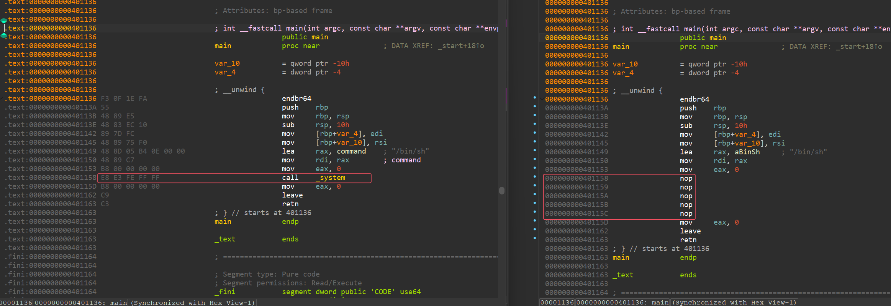

## WAF
参考：[https://github.com/i0gan/pwn_waf](https://github.com/i0gan/pwn_waf)

## getWpath.sh
获取所有可写目录，输出到 writable.txt 中

## RShell.sh
反弹shell

## SelfCopy.sh
自我复制并随机扩散的马
具体效果为 (下面所有内容无限循环)：
1. 在指定目录中 (代码中的 SOURCE_DIR ) 随机创建文件夹，文件夹名为随机值
1. 随机选择指定目录中任意子目录作为复制本体的目标目录
1. 复制本体到新文件，新文件名为随机值
1. 新文件通过 `setsid` 运行，重复上述过程

5. 等待指定时间，循环

代码中包含了一个 CHECK_FILE ，当该文件中的值为 `run` 时上述步骤才会运行，该选项用作实验时停止程序，实战可修改逻辑

自定义文件夹名需要修改 `get_random_dir()` 函数

自定义复制的新文件名需要修改 `generate_random_name()` 函数

使用时需要将脚本放到可写目录下，需要额外添加命令参考 `main()` 中注释部分

## TextNOP.sh

用于在命令行 nop elf 中 指定地址指定长度的 text 段

效果：

用法：

` ./TextNOP.sh <binary> <virtual_address> <nop_length>`

示例 (图示程序)：

`./TextNOP.sh ./shell 0x401158 5`

tips: 命令行反编译使用 objdump 命令

`objdump -d shell | grep -Ax "..."`

x为显示行数

